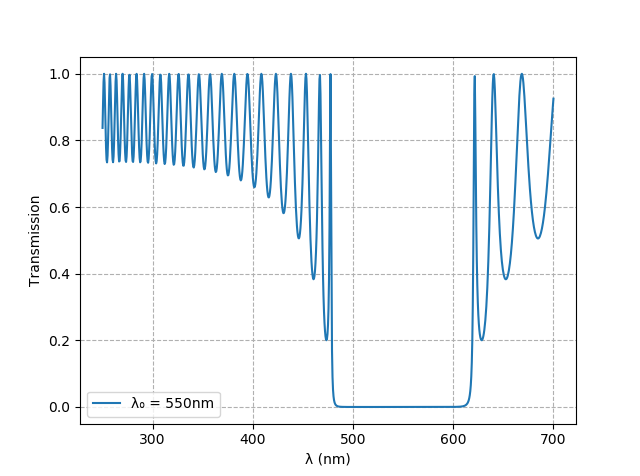

# Dielectric Mirror
Compute the reflective properties of a dielectric mirror using the [Julia](https://julialang.org) language.

If you are interested in the transmission, the output could look like this:

