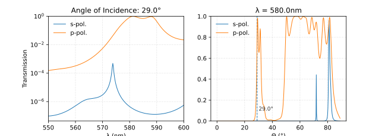
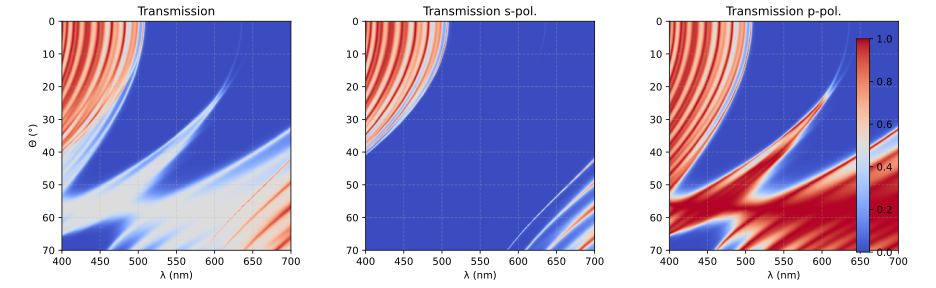

# Dielectric Mirror
Compute the properties of a dielectric mirror using Python the [Julia](https://julialang.org) language.

You can compute the transmission curves for your parameters

Alternatively, have a nice overview.

