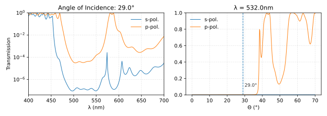
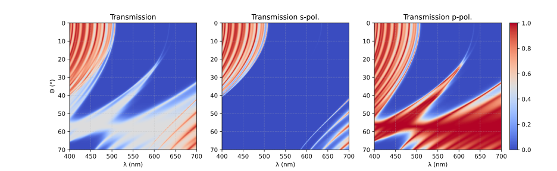

# Dielectric Mirror
Compute the properties of a dielectric mirror using the [Julia](https://julialang.org) language.

You can easily access the transmission curves for certain parameters

Alternatively, have a nice overview.

